<p align="center">
  
</p>

<p align="center">
  
</p>

# Pandemonium patch archive

This is the delivery archive for **Pandemonium**, a classic real-time
strategy game built in Rust. The game's source code lives in its own
repository (`E-Vex/pandemonium-bd`) — this repo holds no source. Instead,
each milestone of work is delivered here as a numbered patch file: the
output of `git format-patch`, containing that milestone's commits in
order and with their original messages. Replaying the patches onto the
source repository rebuilds the project's history — same commits, same
messages, same trees (commit hashes differ, because `git am` re-stamps
them).

## Layout

| Path             | What it is                                                                 |
| ---------------- | -------------------------------------------------------------------------- |
| `patches/`       | The patches, zero-padded and numbered so the listing reads oldest → newest |
| `NOTES.md`       | Per-patch delivery notes — scope, base commit, verification, open asks     |
| `assets/`        | Animated SVGs used by this README (banner, tagline, chart, terminal)       |
| `apply-all.sh`   | A harmless prank: fake progress, a dancing figure, a sad trombone. Applies nothing |

## The patch chain

Patches must be applied in numerical order; each one applies on the HEAD
produced by the one before it. The **Base** column is the source-repo
commit the patch was generated against, as recorded when it was
delivered (`—` where no base was recorded).

<p align="center">
  
</p>

| #   | Milestone                         | Patch                                         | Commits | Base                                       |
| --- | --------------------------------- | --------------------------------------------- | ------- | ------------------------------------------ |
| 001 | M6                                | `001-m6-combat-vision.patch`                  | 12      | —                                          |
| 002 | M6                                | `002-m6-readme-update.patch`                  | 1       | —                                          |
| 003 | M7                                | `003-m7-ai-commands.patch`                    | 7       | —                                          |
| 004 | M8                                | `004-m8-match-rules.patch`                    | 6       | —                                          |
| 005 | M8                                | `005-m8-readme-update.patch`                  | 1       | —                                          |
| 006 | M9                                | `006-m9-alpha-content-feel-pass.patch`        | 6       | M8 HEAD (2861479) — see the M9 note        |
| 007 | M9.1                              | `007-m9.1-input-hotfix.patch`                 | 4       | M9 HEAD (dad840a)                          |
| 008 | pre-M10                           | `008-pre-m10-cleanup.patch`                   | 7       | M9.1 HEAD (1a49c27)                        |
| 009 | pre-M10                           | `009-pre-m10-review-and-scaffolding.patch`    | 8       | M9.1 HEAD (5183fc8)                        |
| 010 | M10                               | `010-m10-stabilization-and-declaration.patch` | 10      | pre-M10 review HEAD (a4393a1)              |
| 011 | M10.1                             | `011-m10.1-decal-render-fix.patch`            | 1       | M10 HEAD (8b4757a)                         |
| 012 | M10.1                             | `012-m10.1-pre-declaration-hardening.patch`   | 5       | decal-fix HEAD (6ec9693)                   |
| 013 | M10.2 Phase 1 (Controls)          | `013-m10.2-phase1-controls.patch`             | 13      | `pandemonium-bd` master (bdf1266)          |
| 014 | M10.2 Phase 2 (Visual legibility) | `014-m10.2-phase2-visual-legibility.patch`    | 14      | Phase 1 HEAD (d84203e)                     |
| 015 | M10.2 Phase 3 (Menus & settings)  | `015-m10.2-phase3-menus-settings.patch`       | 16      | master (404e906) — the Phase 2 HEAD        |

Commit counts are the number of commits in each patch file. For what each
patch actually does, see the matching note in [NOTES.md](NOTES.md) (not
every patch has one yet).

## Applying the patches

<p align="center">
  
</p>

The animation replays patches 013 and 014 (27 commits). The copy-pasteable
version:

```sh
git clone https://github.com/E-Vex/pandemonium-bd.git
cd pandemonium-bd
git checkout <base commit of the first patch you want>

# apply everything, in order:
git am ../stationRepo/patches/*.patch

# or a range, e.g. only 013 and 014:
git am ../stationRepo/patches/013-*.patch ../stationRepo/patches/014-*.patch
```

Start from a clean working tree. `git am` stops at the first patch that
fails and leaves the session in progress so you can inspect it
(`git am --abort` to back out).

> `apply-all.sh` in this repo is a joke — run it for a laugh, but it
> applies nothing.
